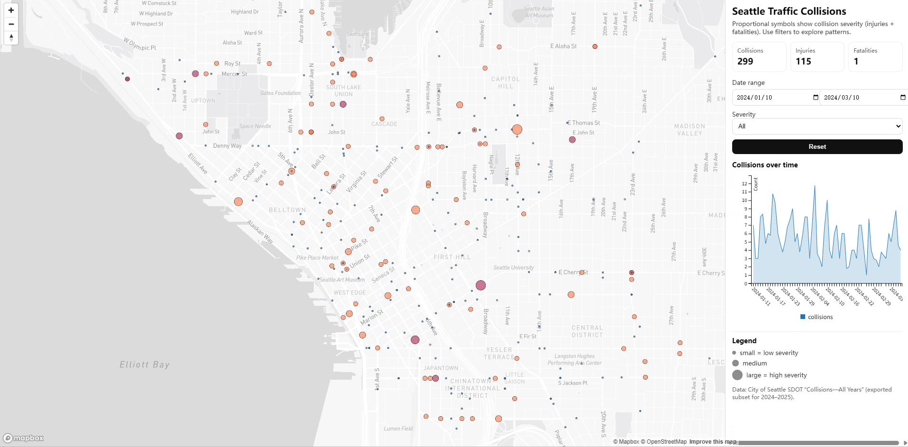

## AI statement
I used AI only to explore and improve interface design (layout and UI wording). I did not use AI for the core idea, dashboard design decisions, or implementation of the dashboard. I did not use AI to write or complete any components where AI use is not allowed. I can explain and justify every coding decision in this project.

# Smart Dashboard: Seattle Traffic Collisions (2024–2025)

This repository contains a smart dashboard built with Mapbox GL JS and C3.js. The dashboard visualizes traffic collisions in Seattle using an interactive proportional symbol map and linked charts. It’s designed to make collision patterns easy to explore by location, time, and severity.

## Live dashboard
https://a1786847133.github.io/SmartDashboardApplication/

## What this dashboard does
The dashboard focuses on one geographic phenomenon: **traffic collisions in Seattle**.

On the map, collisions are displayed as **proportional symbols**:
- **Symbol size** represents severity using `injuries + serious injuries + fatalities`
- **Symbol color** represents collision severity code
- The right panel updates dynamically as you change the **date range**, **severity**.

In the info panel, you can see:
- **KPI counters** (collisions, injuries, fatalities)
- A **time chart** showing collisions over time (based on what is currently visible on the map)
- A legend and a reset button for exploration

## Data
### Primary dataset
- **City of Seattle SDOT – Collisions (All Years)**  
  Exported as GeoJSON and filtered to the project’s time window (2024-01-10 to 2025-01-17).

## Why a proportional symbol map
I used a **proportional symbol map** because collisions are point-based events. A proportional symbol layer is a natural way to show both:
1) Where collisions happen  
2) How severe they are, using symbol size (injuries + serious injuries + fatalities)

The proportional symbols keep the phenomenon tied to the actual event locations.

## Visualization components
1) **Dynamic KPI cards** that summarize the data currently in view (collisions, injuries, fatalities)
2) **A C3.js chart** that visualizes collision counts over time (based on the current map view and filters)

## Connection to our final project idea
This lab is also a stepping stone toward our final project dashboard. I selected Seattle collision data that may be relevant to our final project. This choice is closely tied to our subsequent exploration of traffic flow and parking in Seattle, and may also help refine the direction and significance of our final project based on our lab work. This collisions dashboard fits that direction because safety risk is part of the real-world driving experience. In the final project, collision risk can become an additional “mobility context layer” alongside parking supply, prices, and traffic conditions.

It builds the same core skills we need for the final project:
- loading geospatial data into Mapbox and styling it
- building a coordinated info panel with dynamic KPIs and charts
- filtering and resetting views
- designing a dashboard experience for real users

For the time filter, our final project is tentatively set to use 2022 data, even though the time filter in this lab is currently set to 2024 data. I can modify the date filter in the data to align with our final project.
